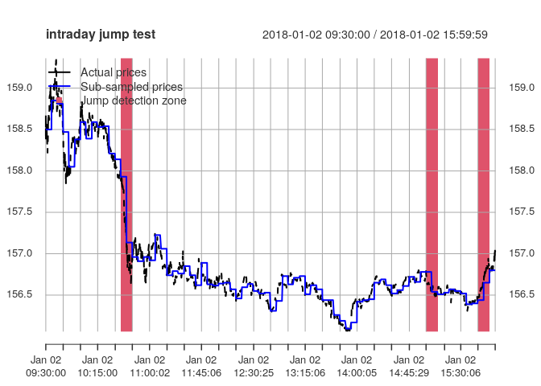
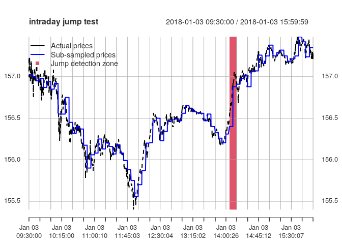

Summary of GSoC 2020
--------------------

-   Organization: *R Project for Statistical Computing*
-   Project: *Expanding the highfrequency package*
-   Mentors: *Dr. Kris Boudt*, *Dr. Onno Kleen*, *Nabil Bouamara*
-   Student: *Emil Sjørup*
-   Project repository link:
    <a href="https://github.com/emilsjoerup/highfrequency" class="uri">https://github.com/emilsjoerup/highfrequency</a>
-   Package repository link:
    <a href="https://github.com/jonathancornelissen/highfrequency" class="uri">https://github.com/jonathancornelissen/highfrequency</a>

Agenda
------

The purpose of this document is to showcase the work that has been done
for this project during GSoC 2020. The agenda is as follows: - Achieved
goals - Unplanned changes - What is left to do - Positive experiences -
Difficulties faced

Achieved goals
--------------

Below is mentioned the goals that were achieved during this GSoC
project. These are listed in the order that they were listed in the GSoC
application. Some of the points have code to show usage examples. \#\#\#
Business time aggregation Implemented business-time aggregation
functions that allow for volume, volatility, and intensity based
sampling of price processes.

    aggVolume <- businessTimeAggregation(sampleTData, measure = "volume", obs = 78)

    aggVolatility <- businessTimeAggregation(sampleTData, measure = "vol", obs = 78, 
                                             method = "RM", lookBackPeriod = 1, RM = "rv", on = "ticks", k = 1)

    aggIntenstiy <- businessTimeAggregation(sampleTData, measure = "intensity", obs = 78)

    ## Compared to the intensity measure of Oomen (2005), the volume and volatility sampling methods produce much more jagged processes
    plot(aggVolume$intensityProcess$`2008-01-04`, type = "l", 
         ylab = "intensity", xlab = "# trade", main = "measure: volume")

    plot(as.numeric(aggVolatility$intensityProcess$`2008-01-04`), 
         type = "l", ylab = "intensity", xlab = "# trade", main = "measure: volatility")

    plot(aggIntenstiy$intensityProcess$`2008-01-04`, type = "l", 
         ylab = "intensity", xlab = "# trade", main = "measure: intensity")

    ## We can see the impact of the different sampling methods compared to the ususal 5-minute RV.
    c("calendar time" = rCov(sampleTData$PRICE, alignBy = "minutes" , alignPeriod = 5, makeReturns = TRUE),
      "volume" = rCov(as.xts(aggVolume$pData$PRICE), makeReturns = TRUE), 
      "volatility" = rCov(as.xts(aggVolatility$pData$PRICE), makeReturns = TRUE), 
      "intensity" = rCov(as.xts(aggIntenstiy$pData$PRICE), makeReturns = TRUE))
    #> calendar time        volume    volatility     intensity 
    #>  0.0004544521  0.0004712922  0.0005386842  0.0005690875

### Improvements to the `refreshTime` function

The `refreshTime` algorithm was rather slow as it had to be rewritten in
R during last years GSoC project. Now it has been ported into C++ and
runs (several) hundred times faster than before. There was a bug that
caused the function to behave incorrectly which was fixed, additionally,
the function returned a duplicate column which is no longer the case.

### Intraday jump test framework

A general framework for intraday jump tests has been implemented. This
is built on top of two already existing functions, `spotVol` and
`spotDrift`. The former of which has been extended to handle
(pre-averaged) realized measures to estimate the local volatility. This
function allows for mixing and matching of spot volatility estimators
and spot drift estimators. Comes with the caveat that support for
pre-averaged realized measures for the local volatility cannot be used
with spot drift estimators (currently).

    ## It is easy to construct a Lee-Mykland test using the intradayJumpTest function
    LMtest <- intradayJumpTest(pData = sampleTDataMicroseconds[, list(DT, PRICE)], 
                               volEstimator = "RM", driftEstimator = "none",
                               RM = "bipower", lookBackPeriod = 10,
                               on = "minutes", k = 5, marketOpen = "09:30:00", 
                               marketClose = "16:00:00")

    plot(LMtest)

    #> Press Enter for next figure or 0 to exit:

    #> Press Enter for next figure or 0 to exit:

### Implementing a `rankJumpTest` function

The `rankJumpTest` function was implemented following the authors of the
paper’s MATLAB code. This function allows for bootstrapping of critical
values of a test whether a detected jump in a market-proxy is a co-jump
with individual stock prices.

### Auto-covariance of noise

The goal was to implement both a function for auto-covariance of noise
from the Jacod, Li, and Zheng (2017) paper as well as ReMeDI estimation.
However, the in the former function there is a bug causing negative
estimates of variance which is seldom a good thing to have. This bug has
not been resolved yet and thus, this function is not exported. The
ReMeDI estimation works fine. To use estimate the auto-covariance
(auto-correlation) of noise, use the `ReMeDI` function. The
`knChooseReMeDI` function implements algorithm 1 in Appendix B2 of Li
and Linton (2020) (working paper) to choose the optimal `kn` parameter.

### `rSemiCov` function

The realized semicovariance estimator in the working paper of
Bollerslev, Li, Patton, and Quaedvlieg (2020) has also been implemented.
This function estimates the negative, positive, mixed, and concordant
semicovariances of N-dimensional return series.

### `rCholCov` function

The CholCov algorithm featured in the Boudt, Laurent, Lunde, Orimar, and
Quaedvlieg (2017) paper has been implemented. The algorithm estimates
the integrated covariance matrix by sequentially adding series and using
`refreshTime` to synchronize the observations. This is done in order of
liquidity, which means that the algorithm uses more datapoints than most
other estimation techniques. The algorithm in principle supports any
estimator of the integrated covariance matrix. The
`listCholCovEstimators` function can be used to see which estimators are
implemented.

    listCholCovEstimators() # Lists the estimators that are available for the CholCov estimation
    #>  [1] "MRC"           "rCov"          "rAVGCov"       "rBPCov"       
    #>  [5] "rHYCov"        "rKernelCov"    "rOWCov"        "rRTSCov"      
    #>  [9] "rThresholdCov" "rSemiCov"

    # Hidden away is some code to simulate correlated Brownian motions with the covariance matrix:
    print(sigma)
    #>      [,1] [,2] [,3] [,4]
    #> [1,]  1.0 -0.5  0.7  0.8
    #> [2,] -0.5  3.0 -0.4  0.7
    #> [3,]  0.7 -0.4  2.0  0.6
    #> [4,]  0.8  0.7  0.6  4.0
    # The prices are constructed such that stock1 is the most liquid, stock 4 is the second most liquid, stock2 is 3rd and stock3 is least liquid
    rCC <- rCholCov(list("stock1" = p1, "stock2" = p2, "stock3" = p3 , "stock4" = p4))
    # We see that the estimated covariance matrix fits the true one rather well, considering we are using only 23400 observations for the most liquid asset.
    rCC$CholCov # Note the order of the matrix has changed - ordered in terms of decreasing liquidity
    #>            stock1    stock4     stock2     stock3
    #> stock1  0.8830352 0.8429389 -0.1744216  0.4375012
    #> stock4  0.8429389 3.7379864  0.5277287  0.7021766
    #> stock2 -0.1744216 0.5277287  2.4439659 -0.4347541
    #> stock3  0.4375012 0.7021766 -0.4347541  1.5872398

### Estimation of lead-lag parameters

The estimation of whether the price of one asset “leads” that of another
has been implemented. In the code-block below, it is tested on some data
included in the package to check whether the NYSE (N) leads the NASDAQ
(T). The code estimates the lead-lag relationship for every millisecond
in the 10 second window from -5000 to 5000 ms.

    NYSE <- tradesCleanup(tDataRaw = sampleTDataRawMicroseconds[as.Date(DT) == "2018-01-02", ], exchanges = "N", report = FALSE)
    NASDAQ <- tradesCleanup(tDataRaw = sampleTDataRawMicroseconds[as.Date(DT) == "2018-01-02", ], exchanges = "T", report = FALSE)
    ll <- leadLag(NYSE, NASDAQ, lags = seq(-5000, 5000, 1), resolution = "milliseconds", parallelize = TRUE, nCores = 8)
    plot(ll)

    print(ll$`lead-lag-ratio`)
    #> [1] 0.9601156

The fact that the lead-lag-ratio is just under 1 is unsurprising and
reveals that the two different exchanges are about equally fast. This is
only natural as latency-arbitrageurs make sure of this.

Unplanned changes
-----------------

### New naming scheme

An all-new naming scheme has been put into the package. Previously the
names of functions were rathre inconsistent. This has now been changed
such that all user-facing functions and arguments are now in
`camelCase`, unless when the function starts with an abbreviation,
e.g. `HARmodel` and `HEAVYmodel`. This large and breaking change has
been made in an effort to limit the risk of having to do such a change
in the future.

### Data handling functions

The data-handling functions used for cleaning trades and quotes data
(TAQ-data) had code that contained bugs. In particular, when using data
with millisecond precision timestamps the code behaved differently
depending on the `digits.secs` option. Having the options set to
`options(digits.secs = 0)` which is the default would in some cases
produce entirely different than when having the options set to
`options(digits.secs = 6)`, even though the underlying data was the
same. This bug led us to scrapping the use of `lubridate` and instead
handling the timestamps as numeric data. This is both faster and offers
support for higher resolution in the timestamps.

The data handling functions additionally had a dependency on `readr` for
reading a csv file. This dependency was scrapped in favor of usnig
`fread` from `data.table`, which we already depend heavily on. This
along with the removal of the `lubridate` dependency means that there is
now far fewer dependencies.

    IP <- installed.packages()
    newDeps <- tools::package_dependencies("highfrequency", db = IP, recursive = TRUE)$highfrequency # GSoC 2020 version

    oldDeps <- tools::package_dependencies("highfrequency", recursive = TRUE)$highfrequency # CRAN version 0.6.5

    print(newDeps)
    #>  [1] "xts"           "zoo"           "Rcpp"          "RcppArmadillo"
    #>  [5] "graphics"      "methods"       "stats"         "utils"        
    #>  [9] "grDevices"     "robustbase"    "cubature"      "mvtnorm"      
    #> [13] "data.table"    "RcppRoll"      "quantmod"      "sandwich"     
    #> [17] "TTR"           "curl"          "DEoptimR"      "lattice"      
    #> [21] "grid"
    length(newDeps) ## 21 dependencies 
    #> [1] 21
    print(oldDeps)
    #>  [1] "xts"           "zoo"           "Rcpp"          "RcppArmadillo"
    #>  [5] "graphics"      "methods"       "stats"         "utils"        
    #>  [9] "grDevices"     "robustbase"    "cubature"      "mvtnorm"      
    #> [13] "data.table"    "RcppRoll"      "lubridate"     "readr"        
    #> [17] "generics"      "tibble"        "hms"           "R6"           
    #> [21] "clipr"         "crayon"        "BH"            "DEoptimR"     
    #> [25] "lattice"       "pkgconfig"     "rlang"         "vctrs"        
    #> [29] "grid"          "cli"           "ellipsis"      "fansi"        
    #> [33] "lifecycle"     "magrittr"      "pillar"        "assertthat"   
    #> [37] "glue"          "utf8"          "digest"        "tools"
    length(oldDeps) ## 40 dependencies 
    #> [1] 40

This GSoC project this helped remove almost half of the 40 dependencies
that was in the 0.6.5 version.

Additionally, there has been many small improvements to the functions
responsible for cleaning and aggregating data.

### Included datasets

Since the behavior of the data cleaning functions changed, the cleaned
data sets that we provide in the package have naturally also changed.

### Several small bugfixes

Naturally, bugs occur. Whenever I have encountered a bug, I have fixed
it (I didn’t come across any that I was unable to fix). Additionally, I
have added unit tests to make sure that the bugs are not reintroduced
again at a later time.

What is left to do:
-------------------

Below is a list of things that were listed as goals, but didn’t for one
reason or another get completed in time

-   Porting code from the `driftBurstHypothesis` package over to
    `highfrequency`.
-   Making a function for the cleaning of Euronext data.
-   Fix the bug in `autoCorrelationOfNoise` so it can be included in the
    next release
-   Improve the simulation code, which was too unfinished for me to want
    to release it yet.

Positive experiences
--------------------

-   Having helpful mentors at my fingertips.
-   Having lots of authority to make changes as I see fit.

Difficulties
------------

-   The simulation code took longer than I thought it would.

